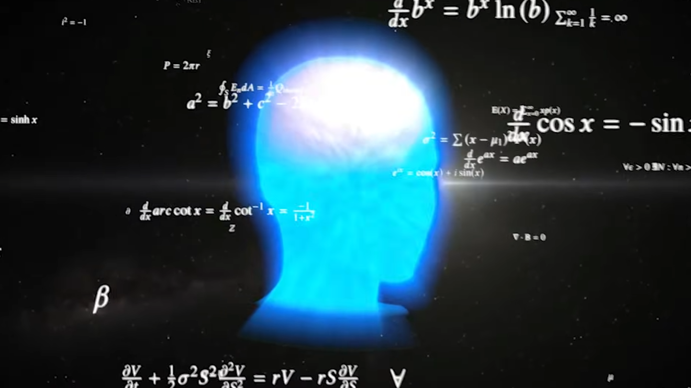

<h1 align="center">TinyML</h1>

  <strong>TinyML v1</strong> is an experimental AI model with approximately 3.1 million parameters. It is built entirely from scratch using only <code>numpy</code>, <code>pickle</code>, and <code>collections</code>, without relying on modern AI or ML libraries.

  Made with ❤️ by <strong>Saaransh_Xd</strong>

  

